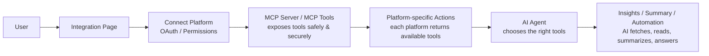
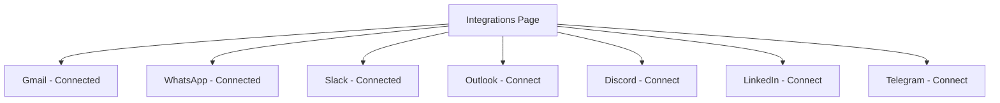
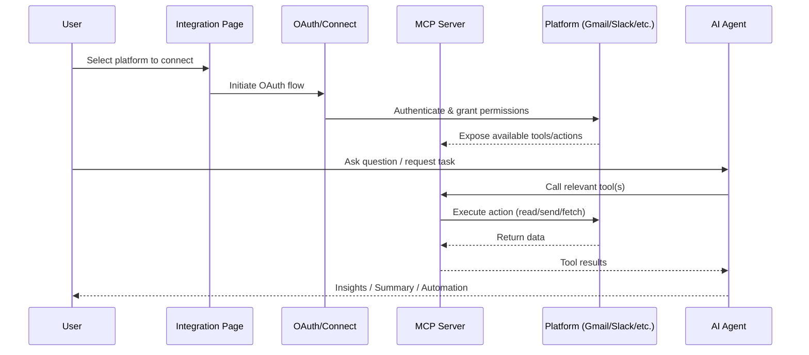
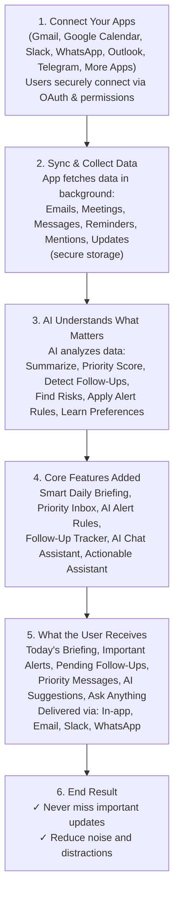
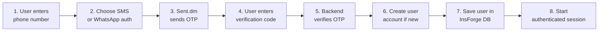
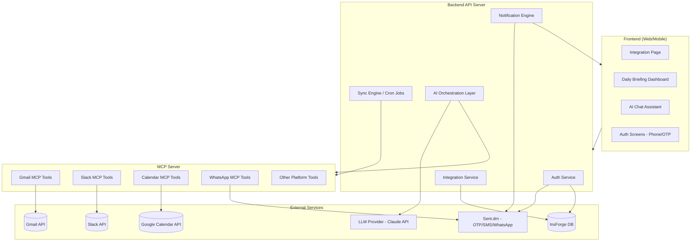
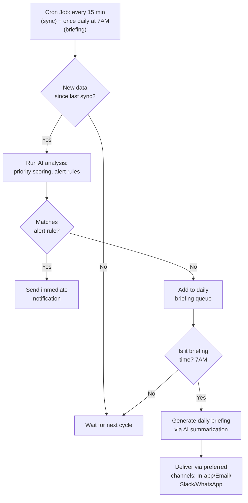
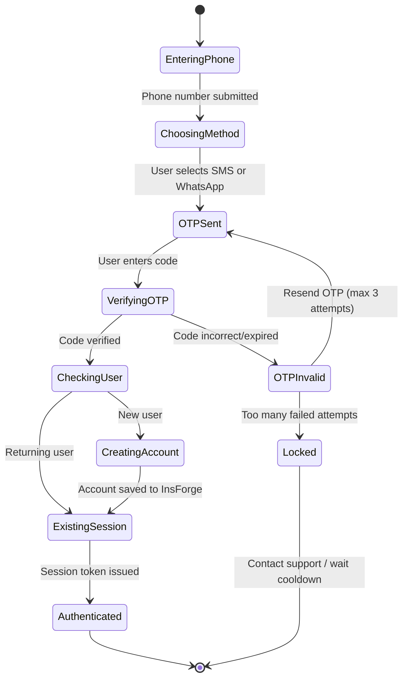

# AI Personal Assistant — Architecture & Build Plan

## 1. Overview

A personal AI agent that connects to a user's everyday apps (Gmail, WhatsApp, Slack, Outlook, Discord, LinkedIn, Telegram, Google Calendar, etc.), continuously syncs data, understands what matters via AI, and delivers daily briefings, alerts, and follow-up actions — all through an authenticated, secure session.

---

## 2. High-Level System Flow



---

## 3. Integration Page

**Purpose:** One place to connect all platforms, see available integrations, and manage connect/disconnect/settings.

### Supported Platforms
- Gmail
- WhatsApp
- Slack
- Outlook
- Discord
- LinkedIn
- Telegram
- Google Calendar
- (Extensible — "More Apps")



---

## 4. Agentic Workflow (MCP-based)

| Step | What Happens |
|------|--------------|
| 1. User | Asks for help or needs info |
| 2. Integration Page | User selects a platform from the page |
| 3. Connect Platform | OAuth / connect account securely |
| 4. MCP Server / MCP Tools | MCP exposes tools safely and securely |
| 5. Platform-specific Actions | Each platform returns available actions (tools) |
| 6. AI Agent | AI chooses the right tools |
| 7. Insights/Summary/Automation | AI fetches, reads, summarizes, and answers |



---

## 5. Example MCP Actions by Platform

| Platform | Actions |
|----------|---------|
| **Gmail** | Read emails, Search inbox, Send email, Get labels |
| **WhatsApp** | Read chats, Send message, Check contacts, Get media info |
| **Slack** | Read channels, Send message, Search workspace, Get mentions |
| **Outlook** | Read mail, Check calendar, Send reply, Get channels, Create event |
| **Discord** | Read server messages, Send message, Get members |
| **LinkedIn** | Read profile info, Fetch messages, View updates, Search people |
| **Telegram** | Read chats, Send message, Search groups, Get members |

---

## 6. What AI Can Do

- Summarize unread emails
- Collect important updates from Slack + Discord
- Find meetings from Outlook/Calendar
- Combine data from multiple platforms
- Answer user questions from connected tools
- Create alerts, insights, and daily briefings

## 7. Why MCP?

- Standard way for AI to use tools
- Easy to add new platforms
- Secure and structured access
- Helps AI agents act intelligently

---

## 8. End-to-End Product Flow (Daily Briefing Assistant)



---

## 9. Authentication Flow (Phone + WhatsApp + Database)

### What We're Building
- Phone number authentication
- WhatsApp OTP authentication
- Verify user with OTP
- Save signed-up user in InsForge database
- Create secure login/session flow

### Why Use Sent.dm?
- One API for SMS, WhatsApp, and RCS
- Easy OTP delivery
- Good for real-world auth flows
- Better user onboarding experience

### Why Use InsForge?
- Store signup user data
- Save phone number and profile info
- Manage authenticated users
- Connect app auth with database



---

## 10. Database Schema (InsForge)

| Field | Description |
|-------|--------------|
| userId | Unique user identifier |
| phoneNumber | User's phone number |
| authProvider | How user authenticated (SMS / WhatsApp) |
| createdAt | Account creation time |
| lastLogin | Last login timestamp |
| profile details | Name, avatar, email, etc. |

---

## 11. Main Auth Features

1. Phone login
2. WhatsApp login
3. OTP verification
4. New user signup
5. Existing user login
6. Database save
7. Secure session
8. Scalable auth system

---

## 12. Use Cases

- AI agent apps
- SaaS products
- CRM dashboards
- Customer onboarding
- Messaging-based apps

---

## 13. Key Takeaways

- Sent.dm handles OTP messaging
- InsForge stores user signup data
- Together they create a full auth system
- Easy to build secure phone + WhatsApp login
- MCP gives the AI agent tool access to each connected platform
- The Integration Page is the single hub connecting apps to the agentic AI flow

---

## 14. Tech Stack Summary

| Layer | Tool/Tech |
|-------|-----------|
| Frontend / Canvas | Eraser.io (planning), React/Next.js (build) |
| Auth & OTP | Sent.dm (SMS/WhatsApp OTP) |
| Database / Backend | InsForge |
| Agent Orchestration | MCP Server + MCP Tools |
| Integrations | Gmail, WhatsApp, Slack, Outlook, Discord, LinkedIn, Telegram, Google Calendar |
| AI Layer | AI Agent (LLM-based, tool-calling) |
| Delivery Channels | In-app, Email, Slack, WhatsApp |

---

## 15. Suggested Build Order

1. Set up InsForge database with the schema above
2. Implement phone + WhatsApp OTP auth via Sent.dm
3. Build the Integration Page (connect/disconnect UI with OAuth)
4. Stand up an MCP server exposing tools per platform (start with Gmail + Slack + Calendar)
5. Build sync/collection layer (background jobs pulling emails, meetings, messages)
6. Add AI layer: summarization, priority scoring, follow-up detection
7. Build "What the User Receives" UI: daily briefing, alerts, priority inbox, AI chat
8. Add delivery channels (email/Slack/WhatsApp notifications)
9. Iterate: add more platforms (Outlook, Discord, LinkedIn, Telegram)

---

## 16. System Architecture (Component View)



---

## 17. MVP Scope vs Full Vision

### Phase 1 — MVP (Weeks 1-4)
- Phone + WhatsApp OTP auth (Sent.dm + InsForge)
- Integration Page with 2 platforms: **Gmail** + **Google Calendar**
- MCP server exposing: read emails, search inbox, check calendar, create event
- Basic AI layer: summarize unread emails + list today's meetings
- Single delivery channel: in-app dashboard only
- Manual "Generate Briefing" button (no cron yet)

### Phase 2 — V1 (Weeks 5-8)
- Add Slack + WhatsApp integrations
- Background sync engine (cron-based, every 15-30 min)
- Priority scoring + alert rules
- Daily briefing auto-generated each morning
- Delivery via email + WhatsApp

### Phase 3 — V2 (Weeks 9+)
- Add Outlook, Discord, LinkedIn, Telegram
- Follow-up tracker
- AI chat assistant (ask questions across all connected data)
- Actionable assistant (draft replies, schedule meetings)
- Learn user preferences over time
- Multi-channel delivery + notification preferences

---

## 18. Project Folder Structure

```
ai-personal-assistant/
├── frontend/                      # Next.js / React app
│   ├── app/
│   │   ├── (auth)/
│   │   │   ├── login/             # phone number entry
│   │   │   └── verify-otp/
│   │   ├── integrations/          # Integration Page
│   │   ├── dashboard/             # Daily briefing UI
│   │   └── chat/                  # AI Chat Assistant
│   ├── components/
│   └── lib/api-client.ts
│
├── backend/
│   ├── src/
│   │   ├── routes/
│   │   │   ├── auth.routes.ts
│   │   │   ├── integrations.routes.ts
│   │   │   ├── briefing.routes.ts
│   │   │   └── chat.routes.ts
│   │   ├── services/
│   │   │   ├── auth.service.ts       # OTP via Sent.dm
│   │   │   ├── oauth.service.ts      # platform OAuth handlers
│   │   │   ├── sync.service.ts       # background sync jobs
│   │   │   ├── ai.service.ts         # LLM orchestration
│   │   │   └── notification.service.ts
│   │   ├── jobs/
│   │   │   └── daily-briefing.cron.ts
│   │   ├── db/
│   │   │   └── insforge.client.ts
│   │   └── config/
│   │       └── env.ts
│   └── package.json
│
├── mcp-server/
│   ├── src/
│   │   ├── tools/
│   │   │   ├── gmail.tools.ts
│   │   │   ├── calendar.tools.ts
│   │   │   ├── slack.tools.ts
│   │   │   └── whatsapp.tools.ts
│   │   ├── server.ts                 # MCP server entrypoint
│   │   └── auth/
│   │       └── token-manager.ts      # refresh token handling
│   └── package.json
│
├── .env.example
├── docker-compose.yml
└── README.md
```

---

## 19. API Endpoint Specification

### Auth Service

| Method | Endpoint | Description |
|--------|----------|-------------|
| POST | `/api/auth/request-otp` | Send OTP via SMS/WhatsApp (Sent.dm) |
| POST | `/api/auth/verify-otp` | Verify OTP, create/login user, return session token |
| POST | `/api/auth/logout` | Invalidate session |
| GET | `/api/auth/me` | Get current user profile |

### Integration Service

| Method | Endpoint | Description |
|--------|----------|-------------|
| GET | `/api/integrations` | List all platforms + connection status |
| POST | `/api/integrations/:platform/connect` | Start OAuth flow for a platform |
| GET | `/api/integrations/:platform/callback` | OAuth callback, store tokens |
| DELETE | `/api/integrations/:platform/disconnect` | Revoke & remove platform connection |
| GET | `/api/integrations/:platform/status` | Check connection health |

### Sync & Briefing Service

| Method | Endpoint | Description |
|--------|----------|-------------|
| POST | `/api/sync/trigger` | Manually trigger sync for current user |
| GET | `/api/briefing/today` | Get today's generated briefing |
| GET | `/api/briefing/alerts` | Get active priority alerts |
| GET | `/api/briefing/follow-ups` | Get pending follow-ups |
| POST | `/api/briefing/alert-rules` | Create/update custom alert rule |

### AI Chat Service

| Method | Endpoint | Description |
|--------|----------|-------------|
| POST | `/api/chat/ask` | Ask a question across connected data |
| GET | `/api/chat/history` | Get chat history |
| POST | `/api/chat/action` | Execute an actionable suggestion (e.g., draft reply) |

---

## 20. Sample MCP Tool Schema (Gmail Example)

```json
{
  "name": "gmail_search_inbox",
  "description": "Search the user's Gmail inbox using Gmail query syntax",
  "input_schema": {
    "type": "object",
    "properties": {
      "query": {
        "type": "string",
        "description": "Gmail search query, e.g. 'is:unread after:2026/06/01'"
      },
      "max_results": {
        "type": "integer",
        "description": "Maximum number of emails to return",
        "default": 10
      }
    },
    "required": ["query"]
  }
}
```

```json
{
  "name": "gmail_send_email",
  "description": "Send an email from the user's connected Gmail account",
  "input_schema": {
    "type": "object",
    "properties": {
      "to": { "type": "string", "description": "Recipient email address" },
      "subject": { "type": "string" },
      "body": { "type": "string" }
    },
    "required": ["to", "subject", "body"]
  }
}
```

**MCP Tool Result format (returned to AI Agent):**

```json
{
  "tool": "gmail_search_inbox",
  "results": [
    {
      "id": "msg_123",
      "from": "boss@company.com",
      "subject": "Q3 Report - Action Needed",
      "snippet": "Please review the attached numbers by Friday...",
      "received_at": "2026-06-11T09:15:00Z",
      "unread": true
    }
  ]
}
```

---

## 21. Environment Variables / Secrets

```bash
# .env.example

# --- Database (InsForge) ---
INSFORGE_API_URL=
INSFORGE_API_KEY=

# --- Auth / OTP (Sent.dm) ---
SENTDM_API_KEY=
SENTDM_SENDER_ID=

# --- LLM Provider ---
ANTHROPIC_API_KEY=

# --- OAuth: Gmail / Google Calendar ---
GOOGLE_CLIENT_ID=
GOOGLE_CLIENT_SECRET=
GOOGLE_REDIRECT_URI=

# --- OAuth: Slack ---
SLACK_CLIENT_ID=
SLACK_CLIENT_SECRET=
SLACK_REDIRECT_URI=

# --- OAuth: Outlook ---
MS_CLIENT_ID=
MS_CLIENT_SECRET=
MS_REDIRECT_URI=

# --- Session ---
JWT_SECRET=
SESSION_EXPIRY=7d

# --- Encryption (for storing OAuth tokens at rest) ---
TOKEN_ENCRYPTION_KEY=
```

**Secrets management notes:**
- Never store raw OAuth access/refresh tokens — encrypt with `TOKEN_ENCRYPTION_KEY` (AES-256) before saving to InsForge
- Use a secrets manager (e.g., Doppler, AWS Secrets Manager, or `.env` + Vault) in production, not plain `.env` files
- Rotate `JWT_SECRET` and `TOKEN_ENCRYPTION_KEY` periodically; support key rotation without breaking existing sessions

---

## 22. Security Considerations

- **OAuth scopes**: Request the minimum scopes needed per platform (e.g., `gmail.readonly` unless send is needed)
- **Token storage**: Encrypt access/refresh tokens at rest; never log tokens
- **Token refresh**: Implement automatic refresh-token rotation in `mcp-server/src/auth/token-manager.ts`; handle expired/revoked tokens gracefully (prompt user to reconnect)
- **Session security**: Short-lived JWT access tokens + longer-lived refresh tokens; httpOnly secure cookies for web
- **OTP security**: Rate-limit OTP requests per phone number (e.g., max 3 per 10 min); expire OTPs after 5 minutes; lock account after repeated failed attempts
- **Data isolation**: All MCP tool calls scoped to the authenticated user's tokens only — never share tokens across users
- **PII handling**: Minimize storage of message content; prefer storing references/summaries over full email/chat bodies where possible
- **Audit logging**: Log connect/disconnect events and AI actions (e.g., "sent email on user's behalf") for transparency

---

## 23. Rate Limiting & Error Handling

| Concern | Strategy |
|---------|----------|
| Platform API rate limits (Gmail, Slack, etc.) | Per-platform request queue with exponential backoff; respect `Retry-After` headers |
| Sync failures | Retry up to 3x with backoff; mark integration status as "needs reconnect" if auth fails |
| LLM rate limits / cost spikes | Queue AI requests; cap tokens per briefing; cache repeated summaries |
| Sent.dm failures | Fallback channel (e.g., SMS if WhatsApp fails); surface error to user |
| Partial sync failures | Don't block entire briefing — show briefing with a note "Slack data unavailable" |
| MCP tool errors | Return structured error to AI agent so it can gracefully inform the user rather than crash |

---

## 24. Notification Scheduling Logic



**Scheduling rules:**
- **Sync jobs**: every 15-30 minutes per user (stagger across users to avoid API rate-limit spikes)
- **Daily briefing**: generated once per day at user's configured time (default 7:00 AM local time)
- **Real-time alerts**: bypass the daily queue — sent immediately when an alert rule matches (e.g., "email from boss")
- **Quiet hours**: respect user-configured do-not-disturb windows for non-urgent notifications

---

## 25. Cost Estimation (Rough, per active user/month)

| Item | Estimate |
|------|----------|
| LLM tokens (daily briefing, ~1 summary/day) | ~5K input + 1K output tokens/day → ~180K tokens/month |
| LLM tokens (AI chat, ~10 queries/day) | ~3K tokens/query → ~900K tokens/month |
| Sent.dm OTP (login, ~2x/month avg) | ~2 SMS/WhatsApp messages |
| Sent.dm alert delivery (if WhatsApp used) | Variable — depends on alert frequency |
| InsForge DB storage | Minimal (metadata + summaries, not full message bodies) |
| Platform API calls (Gmail/Slack/Calendar) | Free tier typically sufficient at low volume |

**Notes:**
- AI chat usage is the biggest cost driver — consider caching common queries and capping daily chat usage on free tiers
- Use a smaller/cheaper model for routine summarization; reserve larger models for complex chat queries
- Re-estimate after Phase 1 MVP with real usage data before committing to pricing tiers

---

## 26. Auth Flow — State Machine



---

## 27. Integration Page — Wireframe Description

**Layout:**
- **Header**: "Connect Your Apps" + subtitle "Securely connect with OAuth & permissions"
- **Grid of platform cards** (3-4 per row): each card shows platform logo, name, and status badge (`Connected` green / `Connect` button blue)
- **"More Apps" card**: opens a searchable modal listing additional integrations not in the main grid
- Each connected card has a kebab menu (`•••`) for: View permissions, Reconnect, Disconnect

## 28. Daily Briefing Dashboard — Wireframe Description

**Layout (top to bottom):**
1. **Header**: "Today's Briefing" + date + refresh button
2. **Summary card**: 2-3 sentence AI-generated overview ("You have 3 meetings, 2 important emails, and 4 follow-ups pending")
3. **Sections (collapsible cards)**:
   - 📅 Today's Meetings (from Calendar/Outlook)
   - 🔔 Important Alerts (priority-flagged items)
   - 📌 Pending Follow-Ups (tracked threads)
   - 💬 Priority Messages (Slack/WhatsApp/Discord highlights)
4. **AI Suggestions panel** (sidebar or bottom): actionable cards — "Reply to Alex", "Schedule meeting with team", each with a one-click action button
5. **Ask Anything bar**: persistent input at bottom to query the AI Chat Assistant directly from the dashboard
6. **Delivery preferences toggle**: small footer control to choose In-app / Email / Slack / WhatsApp delivery